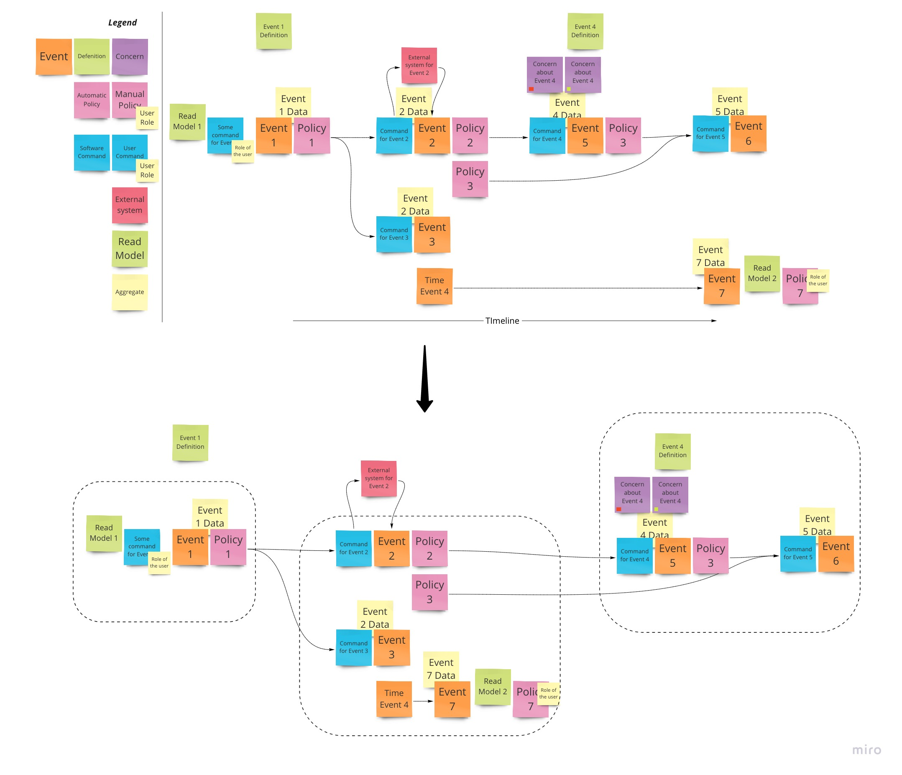

# Event Storming

From [EventStorming website](https://www.eventstorming.com/):  
>EventStorming is a flexible workshop format for collaborative exploration of complex business domains. It comes in different flavours, that can be used in different scenarios. The adaptive nature of EventStorming allows sophisticated cross-discipline conversation between stakeholders with different backgrounds, delivering a new type of collaboration beyond silo and specialisation boundaries.

## Resources

1. Sticky notes (a lot of them, with different colours)
2. Pens  
3. A lot of horizontal space (or a paper roll)
4. Facilitator
5. Domain Experts
6. Stackeholders
7. Intorduction about the problem the scoping session needs to solve

## Terminology

1. The `Event` is something that happens within the domain that we are scoping.
2. The `Definition` should resolve the terminology is not consistent/confussed during the event storming session.
3. The `Concern` in case there is some issue raised about an `Event` or some information that could have an impact on the scoping session. Also, with concern it would be best to define the priority/importance of the concern, so later it can help with planning and prioritization.
4. The `Automatic policy` are actions that are something that happens before system `Command`. They represent the software logic that need to happen before a `Command` is issued. It can be thought in the following manner: Whenever `Event(s)` Then `Command`.
5. The `Manual policy` represents the actions that are based in the software. They represents the a manual action by the some `User Role`. They represent a policy, with difference that it is a manual action and not software one.
6. The `Read Model` represents a data to help the `User Role` to carry out the command. This is usually associated with the `Command` that is starte by user, that is `Command` that has `User Role` associated with it.
7. The `Command` is usually paired with an `Event`. They represent action/interaction/decission that leads to the event that `Command` is paired with.
8. The `External system` is something that our domain depends on, but it has no control over it. This also can represent an internal system but it is not part of the domain of the scoping session.
9. The `Aggregate` represents some kind of data (data holder) within the domain. It allows grouping of `Commands` and `Events`.
10. The `Boundry` groups related `Aggregates`. Related by language/concepts.

## Conventions

1. The `Event` usually are represented using orange colour.
2. Pasttense verbs to desctibe the events, to ensure that timeline is consistant.
3. In case `Events` need to happen at the same time, they are stacked vertically.
4. In case of time-triggered `Event`, it is model as the regular `Event` that is linked with the `Event` that will be the cause of it. Simply said, it is an `Event` that has as a result some other `Event` after some time passes. In this, there is no `Command` involved, by the user or system itself.
5. Define a timeline for the events.
6. Stick to the Domain language, so all people are on the same page and understand what is being talked about.
7. In case of confussion/different opinions/terminologies define `Definition` to guide the session further. This is usually in same row as the `Event` it describes but above of it.
8. If the concern/issue/risk is raised about particular `Event`, then an `Concern` should be added with some prioritization.
9. Encourage questions to resolve the assumptions during the scoping sessions.
10. The `Commands` are usually represented by using a blue sticky notes.
11. The `Command` that is carried out by the `User` is usually paired with the `User Role` on the command itself.
12. The `Command` that is triggered by the system, doesn't have the role associated with it.
13. The `Command` should be desciptive to provide details on what needs to happen to cause the `Event`.
14. The `External system` is usually represented by pink colour.
15. Use markers/lines to show the interaction between domain being scoped and the `External system`.
16. The `Policy` should bring forth the implicit logic out and check if that logic should cause any additional `Command`/`Event`.
17. In case that `Automatic policy` has no reactive logic associated with it, it can be removed.
18. The `Read Model` can be represented as a small UI design or some other action to clearly indicate later on what needs to be provided to the `User Role` to sucesfully executes the `Command`.
19. The `Command` acts upon `Aggregate`, so usually in scoping session they are represented in between `Command` and `Event`.
20. The `Aggregate` is usually represented with an yellow colour.
21. The `Aggregate` name should be a noun.
22. The `Boundry` is a good guide for definning your software concepts as well (think microservices and bounded contexts).
23. Review `Boundries` before closing the scoping session. Identify other reasons to further decompose/split into additional `Boundries`.

## Example

