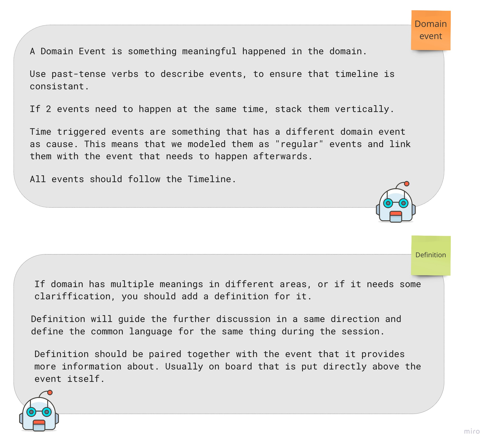
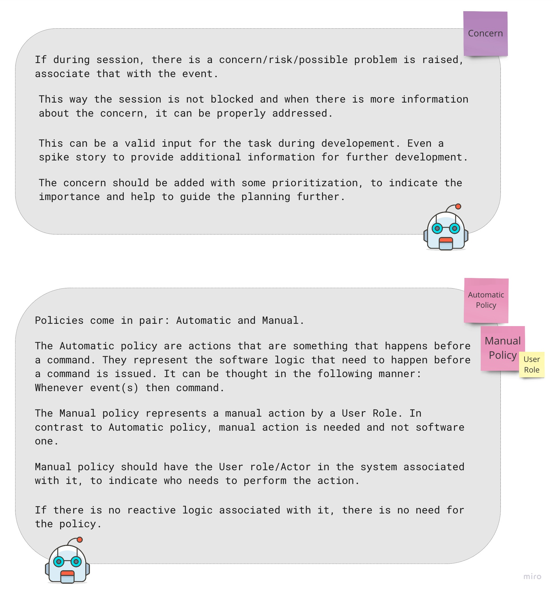
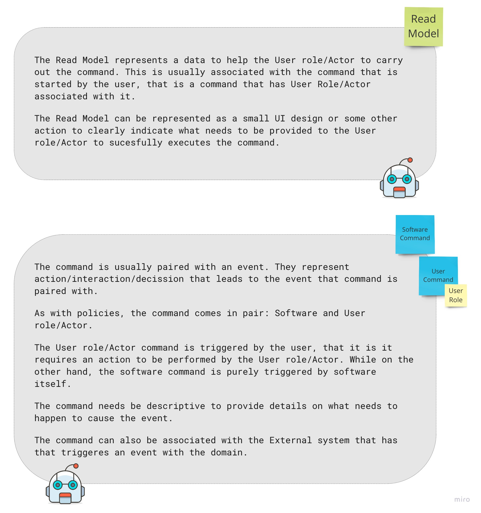
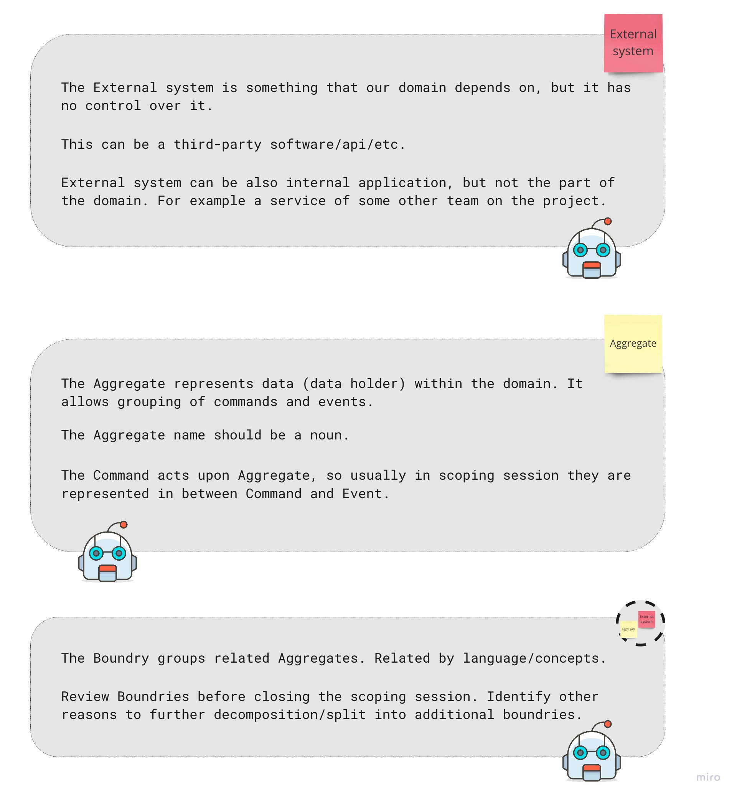
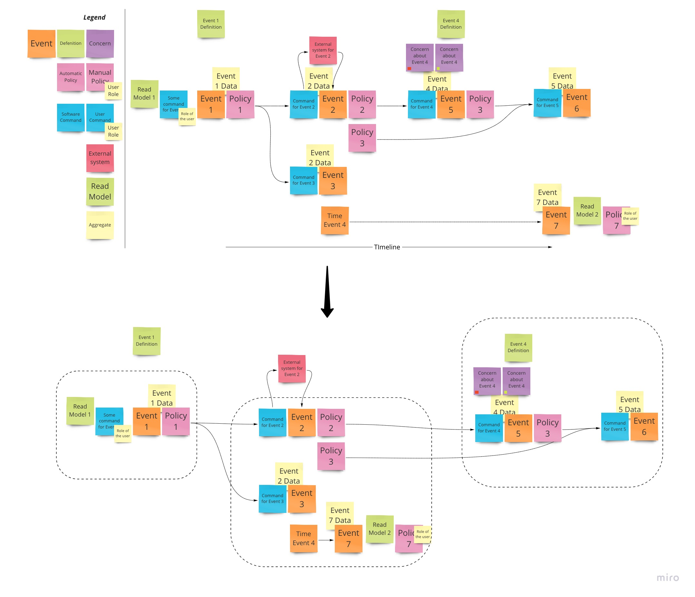

From [EventStorming website](https://www.eventstorming.com/):  
>EventStorming is a flexible workshop format for collaborative exploration of complex business domains. It comes in different flavours, that can be used in different scenarios. The adaptive nature of EventStorming allows sophisticated cross-discipline conversation between stakeholders with different backgrounds, delivering a new type of collaboration beyond silo and specialisation boundaries.

## Resources

1. Sticky notes (a lot of them, with different colours)
2. Pens  
3. A lot of horizontal space (or a paper roll)
4. Facilitator
5. Domain Experts
6. Stackeholders
7. Intorduction about the problem the scoping session needs to solve

## Terminology & conventions

## Example

## Materials

[Official website](https://www.eventstorming.com/#resources)  
[Blog post from Alberto Brandolini (The inventor of Event Storming)](https://ziobrando.blogspot.com/2013/11/introducing-event-storming.html)  
[YouTube talk about EventStorming](https://www.youtube.com/watch?v=1i6QYvYhlYQ)